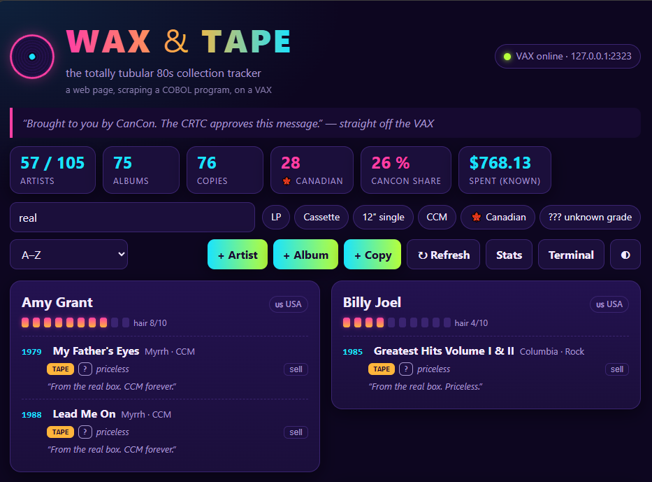

# waxweb -- a web front end that screen-scrapes a VAX

A modern single-page web UI for **WAX & TAPE**, the COBOL + Rdb collection tracker that runs on an
OpenVMS VAX.  The VAX program is untouched menu-driven terminal software; this server logs in over
telnet, starts it, and *types at its menus like a person*, turning the text screens it prints into JSON
for the browser.  (The UI even has a live "VAX terminal" drawer showing the screens being scraped.)



```
 browser  <--HTTP-->  waxweb.py  <--telnet-->  VAX: @RUN_WAXR  ->  COBOL + embedded SQL  ->  Rdb
 (static SPA)        (Python 3.7, stdlib only)      (menu screens, fixed-width text)
```

## Files

| File | Purpose |
|---|---|
| `vaxterm.py` | tiny telnet terminal (IAC negotiation, VT100 stripping, send/read-until-prompt) |
| `waxscrape.py` | parsers for the roll-call / stats screens, and the session driver that plays the menus (pager, Y/N pickers, add/sell flows) |
| `waxweb.py` | HTTP server: JSON API + static files, optional basic auth |
| `static/` | the single-page UI (no build step): search, filters (LP / cassette / 12" / CCM / Canadian), add/sell dialogs, stats and terminal drawers |
| `fakevax.py` | a fake VAX (VMS login + a Python port of the WAXR screens) for development and tests |
| `run_demo.py` | web app + fake VAX in one process (`python3 run_demo.py`, then http://localhost:8088) |
| `tests/` | parser tests against **real captured VAX screens** + end-to-end tests against `fakevax` |
| `deploy/` | systemd user units, env template, tunnel script, deploy script, VMS account setup |

Run the tests with `python3 -m unittest discover -s tests -v` (Python 3.7+; no dependencies).

## How the scraping works

* **Login:** read `Username:` / `Password:`, send them (the password is never logged -- the transcript
  shows `********`), then set a unique DCL prompt (`<<WAX>> `), widen the terminal, `SET DEFAULT` to the app
  directory and `@RUN_WAXR`.  The menu prompt `Your pick, music lover:` is the "ready" marker for everything.
* **Reading:** option 1 (roll call) is walked page by page -- every `-- more --` pager prompt gets an Enter.
  Lines are fixed-width (`DISPLAY` of COBOL fields), so the parser slices by column.  Option 8 gives the stats
  and verdicts; the roll call's last line supplies the quip shown at the top of the page.
* **Writing:** add artist/album/copy and sell are driven through the same prompts a person would answer.
  The "Is it X? (Y/N)" / "This one? (Y/N)" pickers are answered by comparing the on-screen name/title/artist
  with the one wanted (`Y` on an exact match, `N` otherwise), and a sale double-checks the numbered list it is
  shown before choosing a copy -- if it does not match what the UI expected, it answers `0` (keep everything).
* **One session, one lock:** a single logged-in VMS session serves all requests, serialised by a lock; if the
  session breaks it is dropped and re-created on the next request.  The roll call is cached (default 120 s)
  and invalidated by every write.

## Running it for real

1. **The VAX side** -- create the dedicated low-privilege account and grant it the program + database:
   see `deploy/vms_account.txt`.
2. **Reaching the VAX.**  A Raspberry Pi hosting SIMH cannot talk to its own pcap-bridged guest, so run the
   tunnel from any machine that can reach the VAX: `VAX_IP=a.b.c.d deploy/tunnel.sh webhost`
   (opens `webhost:127.0.0.1:2323 -> VAX:23`).  Or point `VAX_HOST`/`VAX_PORT` at wherever telnet is reachable.
3. **On the web host:** `deploy/deploy.sh webhost` copies the app and installs the systemd *user* units; create
   `~/.config/waxweb.env` from `deploy/waxweb.env.example` (mode 600) with the VMS account's password, then
   `systemctl --user enable --now waxweb`.  (`loginctl enable-linger` keeps user services alive after logout.)
4. Browse to `http://<web host>:8088`.  `WAXWEB_AUTH=user:pass` adds HTTP basic auth.

`waxweb-demo.service` runs the same UI against the built-in fake VAX on port 8089 -- handy for a look
without touching the VAX.

## Security notes

* The web app holds a VMS password: use the dedicated unprivileged account, keep the env file `chmod 600`,
  and never commit it.
* The UI can add and *delete* records.  It has no login of its own unless you set `WAXWEB_AUTH`; keep it on
  a trusted LAN or put it behind a reverse proxy with authentication.
* `/api/transcript` exposes the scraped screens (not the password) -- same trust boundary as the UI.
* Input going to the VAX is stripped of control characters and truncated to the COBOL field widths.
